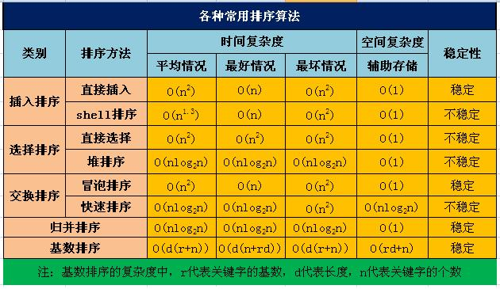

Notes
---

## My View
Python itself is easy. Python's labraries are complex, however. How to learn this language quickly? How to understand this language deeply?

## Books
- Basic
  - Learning Python, 5th Edition
  - Python_Cookbook_3rd_Edition
- Advanced
  - Data Structures and Algorithms in Python-2013
  - Python for Data Analysis 2nd Edition
- Libraries
  - [NumPy](http://www.numpy.org/)
  - [Matplotlib](https://matplotlib.org/)
  - [Pandas](http://pandas.pydata.org/)
  - Scikit-learn [sklearn](https://scikit-learn.org/stable/)
  - [TensorFlow](www.tensorflow.org)
  - [Seaborn](http://seaborn.pydata.org/)
  - regex [文档](https://docs.python.org/zh-cn/3/library/re.html) 以及此 [regex HOWTO](https://docs.python.org/zh-cn/3/howto/regex.html)

## Philosophy 
```
The Zen of Python, by Tim Peters

Beautiful is better than ugly.
Explicit is better than implicit.
Simple is better than complex.
Complex is better than complicated.
Flat is better than nested.
Sparse is better than dense.
Readability counts.
Special cases aren't special enough to break the rules.
Although practicality beats purity.
Errors should never pass silently.
Unless explicitly silenced.
In the face of ambiguity, refuse the temptation to guess.
There should be one-- and preferably only one --obvious way to do it.
Although that way may not be obvious at first unless you're Dutch.
Now is better than never.
Although never is often better than *right* now.
If the implementation is hard to explain, it's a bad idea.
If the implementation is easy to explain, it may be a good idea.
Namespaces are one honking great idea -- let's do more of those!
```

- basic
- features
	- iterator
	- generator
	- decrator
	-
- built-in functions
- method of coding

### naive-ipython.ipynb

On Thursday, 23. May 2019 04:46PM, I firstly practice python with Jupyter Notebook. This file is the output.
The code in this file is very naive. However, I will leave it here to urge me to move on

you should also know the shortcuts of Jupyter.
Magic happens when you press H or P at command mode

Practice the shortcuts in your later progrmming career. Enjoy it.

Everyday, the first line of python should be 
** import this **


### python_basic_cheatsheet.py

This file is much older than any others in this repo.
When I first learnt python, I coded this file in absolute python lines.

I wanted this file to record all the features of this programming language, and use it as a memo to copy some piece from it.

This file is only for grammars of python

### toy-tensorflow.ipynb
this fiile contains some simple features when I learn TensorFlow. I also wish to record my study roadmap of studying DL.

### python_interview_question.md
From [link](https://github.com/kenwoodjw/python_interview_question)
You could not get the real skill without some practice. These questions help me to think of this language.
I will output my [notebook](python_interview_question-my_solution.ipynb)


### Play Ground
#### sort 


- [python 十大经典排序算法](https://www.cnblogs.com/wuxinyan/p/8615127.html)


### pip install 
```
国内常用的pip源如下：
阿里云 http://mirrors.aliyun.com/pypi/simple/
豆瓣(douban) http://pypi.douban.com/simple/ 
清华大学 https://pypi.tuna.tsinghua.edu.cn/simple/
中国科学技术大学 http://pypi.mirrors.ustc.edu.cn/simple/
```

### 远程访问jupyter notebook
` https://www.cnblogs.com/yangxiaolan/p/5778305.html`
